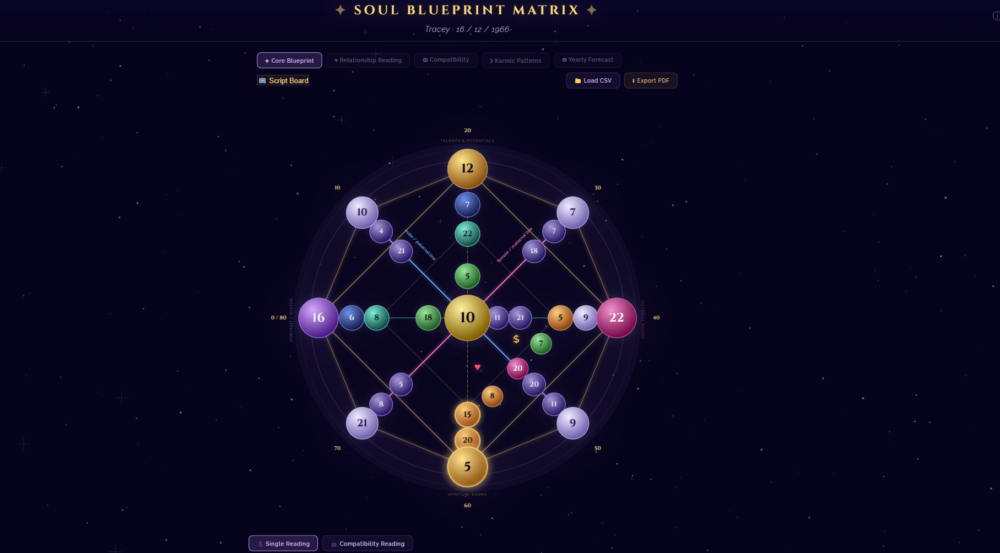
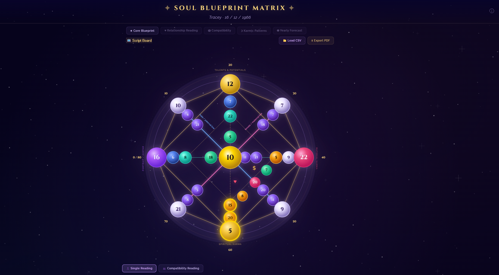

# Changelog - Soul Blueprint Matrix (New Features Sync)

## [August 2026] - Soul Potentials, Dual DB Switcher, DOB Relocation & Emotional Closeness

This major update implements client-requested workflow features, new numerological calculation positions, a dual-database switching architecture, and Nika Matrix methodology alignment for feelings and emotional closeness.

### 🎯 Nika Matrix 100% Chart Positions & Tooltips Audit
- **Relationship Channel Correction**:
  - Moved **`Point M` (Ideal Partner / Meeting Place)** to its true Nika position inside the Relationship Channel (Heart ❤️ Line at `x=480, y=608`).
  - Positioned **`Point J` (Subconscious Block / Relationship Entry)** on the bottom vertical line (`y=645`), replacing the misplaced `M` tooltip.
  - Positioned **`Point R` (Relationship Gateway Code)** and **`Point N` (Suitable Profession / Niche)** strictly on their official Nika channel coordinates.
- **Core Axis Node Re-Alignment**:
  - **Left Horizontal Line**: Corrected `A2` (Parent-Child Karma at `x=197`) and `A1` (Soul Task for Children at `x=247`).
  - **Top Vertical Line**: Corrected `B2` (Self-Realization / Profession at `y=222`) and `B1` (Personal Talent from Birth at `y=281`).
  - **Right Horizontal Line**: Corrected `K` (Entry to Finance Line at `x=617`) and `C1` (Earning Experience Field at `x=668`).
  - **Bottom Vertical Line**: Corrected `D1` (Subconscious Fears / Karmic Tail Code at `y=697`).

### 🔮 New Calculation Positions: Soul Potentials (U1, U2, U3)
- **Point U1**: Higher Soul Potential 1 (`A + B` reduced numerology).
- **Point U2**: Higher Soul Potential 2 (`C + D` reduced numerology).
- **Point U3**: Combined Soul Synthesis (`U1 + U2` reduced numerology).
- Added a dedicated **Soul Potentials** derived table panel beneath the chart. Clicking any row opens its detailed reading in the side panel.

### 💖 Nika Methodology: Emotional Closeness (Points O, P, OP - Chapter 3.7)
- **Point O**: Material Emotional Closeness (`A2 + E` — feelings in daily physical life with family, friends, partners).
- **Point P**: Spiritual Emotional Closeness (`B2 + E` — higher spiritual feelings of love, joy, empathy, compassion).
- **Point OP**: Emotional Closeness Synthesis (`O + P` — 3rd derived Arcanum / Anahata Heart Program).
- Integrated a dedicated **Emotional Closeness** table panel below the chart and synchronized all values with the Script Board.

### ⚡ Dual Database Switcher (LIVE vs. Deep Dive)
- **Nav Mode Toggle**: Added a top nav button to toggle between **`⚡ LIVE Mode`** (`interpretations.csv`) and **`🔮 Deep Dive`** (`interpretations_deep.csv`) without page reload.
- **Graceful Fallback**: Automatically falls back to LIVE mode with an informative notification if the deep database is not present.
- **Script Board Sync**: Broadcasts the active database mode so the pop-out Script Board displays a `⚡ LIVE` or `🔮 Deep Dive` badge.

### 📦 Build & Release Automation
- **`tools/package_release.py`**: Automated compilation and versioned ZIP archive creation (`SoulMatrix_v1.2.0_TIMESTAMP.zip` and `SoulMatrix_v1.2.0_Latest.zip`).
- **`build_release.bat`**: One-click batch launcher supporting both Python and zero-dependency PowerShell packaging fallbacks. Automatically packages optional deep database files when present.

---

## [July 2026] - Yearly & Couple Forecast Integration

This major update introduces the complete **Yearly Forecast** and **Couple's Forecast** engine, parsed directly from Nika Matrix's ebook and integrated into the interactive chart, derived panel, and pop-out Script Board streamer view.

### 📅 Ebook Parsing & XLSX Population
- Developed scripts to parse Nika Matrix's book (`docs/COUPLE’S FORECAST .md`) for all 22 Arcana (Themes, Risks/Watch Outs, and Recommendations) for both single and compatibility mode readings.
- Populated the master spreadsheet (`data/interpretations.xlsx`) sheets `Master_Database` (position: `FORECAST`) and `Compatibility` (position: `COMPAT_FORECAST`).
- Configured automated fallbacks to personal forecast interpretations for rare energies (e.g. Arcana 1 and 2) to ensure a complete dataset.

### ⚙️ Database Synchronizers Upgrade
- Upgraded the column-mapping engines in both Python (`tools/update_interpretations.py`) and PowerShell (`tools/update_interpretations.ps1`) to transparently parse and sync the custom `FORECAST` and `COMPAT_FORECAST` positions.

### 🔮 Frontend Calculation Engine
- **Age Extraction**: Added dynamic client age calculation from DOB input.
- **Outer Age Ring Resolver**: Added mathematical subdivision calculations to map any integer age to the correct segment on the 80-year outer timeline.
- **Key Energies Formula**: Implemented calculations for Energy 1 (Current), Energy 2 (Key Energy shift of +/- 40 years), and Energy 3 (reduced Outcome).
- **Couple Forecast Formula**: Implemented couple forecast calculations by adding and reducing the corresponding partner forecast keys.

### 💎 Interactive UI Enhancements
- Added a clickable **Personal Forecast** (or **Couple Forecast** in compatibility mode) widget inside the derived panel at the bottom.
- Hovering/selecting age ring nodes highlights the active current age segment on the octagram chart in gold.
- Activated the top navigation button **"◎ Yearly Forecast"** to instantly open yearly forecast detail interpretations.
- Fully synchronized Yearly Forecast calculations to the pop-out **Script Board** viewer over BroadcastChannel sync.

### 🛠️ Position Mapping & Smart Tab Selection Fixes
- **R & R1 Love Channel Alignment**: Updated database synchronizers (`update_interpretations.py` & `update_interpretations.ps1`) so position `R` (Money & Relationships) and `R1` (Relationship Dynamics) map cleanly to the `relationships` module (`Love` tab).
- **Section Name Sanitization**: Enhanced section name parser to handle custom Excel section titles (e.g. `Love/relationship - problems`) by sanitizing punctuation and mapping to standard section keys (`wound`, `partner`, `lesson`, `meaning`).
- **Smart Module Tab Auto-Selection**: Upgraded `openPanel()` in `soul_matrix.html` to automatically detect which module tab contains interpretation data for any clicked chart node, ensuring nodes like `R`, `R1`, `R2`, `L`, `M`, `S`, and `N` immediately switch to the active interpretation tab (`Love`, `$ Money`, `Karma`, etc.).
- **Ancestral Line Position Label Alignment**: Corrected ancestral line node names across the SVG chart, side panel metadata, script board, and derived calculations to align 100% with the Matrix handbook:
  - **F**: `Father's Male Line` (`A + B`)
  - **G**: `Father's Female Line` (`B + C`)
  - **H**: `Mother's Male Line` (`C + D`)
  - **I**: `Mother's Female Line` (`D + A`)
  - Derived nodes updated accordingly (`F1`, `F2`, `G1`, `G2`, `H1`, `H2`, `I1`, `I2`) and derived calculation rows updated to **Male Lines (`F+H`)** and **Female Lines (`G+I`)**.

---

## [June 2026] - Zero-Dependency Windows Fallback & Sync Fixes

This update adds a zero-dependency database compilation fallback for Windows users, fixes launcher execution diagnostics, and corrects compatibility mapping.

###  Zero-Dependency PowerShell Synchronizer
- Created `tools/update_interpretations.ps1` using native Windows PowerShell COM Automation to parse Excel files without requiring Python, pip, or `openpyxl`.
- Integrates automatically in `run_update.bat` as a transparent fallback if Python is missing or if library installation fails.

###  Robust Launcher & Diagnostic Updates
- Upgraded `run_update.bat` to detect and filter out the default Windows Store dummy `python.exe` alias.
- Added explicit try-catch error blocks and pause states so launcher windows do not close immediately, allowing users to see exact error logs.

###  Compatibility Mapping & Loading Fix
- Corrected sheet column mapping functions to align Excel's "General Compatibility" rows directly to `compat_general` / `meaning` keys.
- Ensured fresh CSV updates are fetched on reload.

---

## [June 2026] - Outer Age Timeline Nodes (on branch `feature/outer-age-nodes`)

This update introduces **56 clickable, intermediate age timeline nodes** along the outer edges of the Destiny Matrix chart (e.g., `21-22,5`, `25 years old`, `26-27,5`). They are calculated dynamically using standard subdivisions and fully integrated with the database sync engine, main dashboard panel, and pop-out Script Board.

###  Dynamic Age Node Calculations
- Implemented numerological calculations for 7 sub-nodes per decade (e.g., Age 21.25, 22.5, 23.75, 25, 26.25, 27.5, 28.75) within each of the 8 main sectors.
- Automatically computes values using binary subdivision formulas, both for single readings and compatibility mode charts.

###  SVG Rendering & Premium Aesthetics
- Dynamically generates small clickable nodes along the perimeter lines of the octagram SVG.
- Places outward text range labels perpendicular to the octagram boundaries.
- Styled hovered/selected age nodes with vivid lavender glow rings, highlighted strokes, and golden active ranges.
- Integrated selection listeners that auto-navigate the details panel to the `◎ Forecast` (or `◎ Couple Forecast` for compatibility) tabs.

###  Pop-out Script Board Integration
- Groups the 56 new age nodes under a dedicated, collapsible ** Outer Age Timeline** section in the sidebar list.
- Organizes the sub-nodes logically into decade folders (e.g., `Ages 20 to 30`) to keep the interface clean.
- Supports real-time cross-window synchronization, triggering appropriate forecast modules when selected on either screen.

###  Sync Engine Upgrades
- Enhanced `tools/update_interpretations.py` to identify positions starting with `AGE` (e.g., `Age22.5`, `Age 25`).
- Automatically maps age nodes to the forecast module and yearly section, bypassing strict integer key validations for decimal coordinates in Excel.

---

## [June 2026] - Destiny Matrix Compatibility Chart Support (on branch `feature/modern-chart-visuals`)

This update introduces a full **Compatibility Matrix Chart** combined from two Dates of Birth (DOBs), complete with real-time sync for pop-out screen viewing, custom Excel database management, and program/combination detection.

###  Compatibility Calculations & Tabs
- Computes combined matrix numbers by adding corresponding nodes of Partner 1 & Partner 2 (reduced using base-22 numerology).
- Dynamically loads compatibility-specific tabs (e.g. ` General`, ` Love Dynamics`, `$ Shared Finance`, ` Relationship Karma`) and filters out single-DOB reading tabs.
- Supports adding custom compatibility categories and sections in Excel without changing any code.

###  Excel-to-CSV Database Sync
- Sync tool now reads from a new **`Compatibility`** worksheet inside `data/interpretations.xlsx`.
- Automatically maps compatibility sections to `compat_` prefixed modules and compatibility programs to `compat_programs` inside the unified `data/interpretations.csv`.

###  Pop-out Script Board Synchronization
- Added `readingMode` synchronization over the `BroadcastChannel`.
- The pop-out Script Board automatically updates its header details (displaying both client names and birth dates), sidebar nodes, and tabs to match the main screen's reading mode (Single vs Compatibility).

---

## [June 2026] - Modern Chart Visual Refresh (on branch `feature/modern-chart-visuals`)

This update delivers a visual modernization of the interactive chart dashboard with vibrant gradients, bolder outlines, glowing node effects, improved labels contrast, and micro-interactions.

###  Visual Comparison (Before vs After)

#### Before Visual Refresh

#### After Visual Refresh

### Key Enhancements

| Element / Area | Before the UI Change | After the UI Change |
| :--- | :--- | :--- |
| **Zone Colors** | Mostly purple-lilac scheme across all nodes, making the different areas blend together. | **Vibrant Theme Gradients**; each area has a distinct identity (e.g. Portrait = Deep Purple, Karma = Gold/Amber, Material Karma = Crimson-Pink, Money/Relations = Emerald Green). |
| **Node Outlines** | Thinner borders (`1.6px`) with muted color values. | **Bolder Outlines (`1.8px`)** in matching vivid colors, providing a crisp, high-definition look. |
| **Node Glow Effects** | Standard low opacity (`.10`) fills with minor blur. | **Premium Neon Glow (`.18` opacity)** with increased blur deviation, giving selected/hovered nodes a high-end glowing look. |
| **Zone Label Visibility** | Lower contrast (`opacity: .4`), smaller fonts. | **High Contrast (`opacity: .60` or higher)** and slightly larger font sizes, making zone titles like `TALENTS & POTENTIALS` easy to read. |
| **Age Timeline** | Default font values, lower contrast. | **Prominent Timeline Labels** with high-contrast text (`opacity: 0.95`), framing the chart geometry perfectly. |
| **Hover Transitions** | Basic brightness boost. | **Micro-interactions** including scale zoom (`transform: scale(1.08)`) and bright neon outlines. |

---

## [June 2026] - Usability & Sync Adjustments

This update refines the live reading experience with enhanced text controls, active program overlays, and interactive cross-window navigation.

### Adjustments Implemented
- **Script Board Font Zooming**: Expanded font sizing to four granular levels (Small, Medium, Large, Extra Large) with persistent storage and active button highlighting.
- **Active Programs Display on Script Board**: Displays a summary of all active programs in the default reading pane view when no node is selected, and adds an "Active Programs" section at the top of the sidebar.
- **Program Visual Highlighting**: Adds a pulsing gold/orange drop-shadow glow and stroke animation to mark active program numbers on the main chart SVG.
- **Interactive Navigation**: Integrates click navigation from the main chart's active program dashboard to open, focus, and smoothly scroll to the program description on the Script Board.

---

## [June 2026] - Script Board & 3-Number Programs Update

This update introduces real-time multi-screen synchronization (perfect for live streaming) and dynamic support for combined 3-number Destiny Matrix programs.

---

### 1. New Features

####  Pop-out Script Board (`script_board.html`)
- Created a separate window view designed to be dragged onto a second monitor.
- Real-time bidirectional click synchronization (clicking a node on either screen syncs the other screen).
- Client metadata header showing calculated name and Date of Birth.
- Text zooming controls (`A`, `A+`, `A++`) to adjust reading text size on a second screen.
- Left-sidebar node navigator showing all calculated numbers at a glance.
- Dedicated tabs for module classifications and an active programs overview.

####  Dynamic 3-Number Combination Programs
- Integrated checking logic that automatically detects when three computed chart nodes match a combination code defined in your interpretations database.
- Designed a new "Active Programs" widget in the main dashboard next to the Purpose calculations.
- Integrated program reading cards into the side panels of any individual nodes that form part of active combinations.

---

### 2. Improvements & Sync Enhancements

####  Excel Synchronizer (`update_interpretations.py`)
- Upgraded mapping and validation logic to process 3-number combinations (e.g., matching position `M-N-D` with code `15-20-5`).
- Removed strict integer format constraints on the `Number` column to support string combination values (like `15-20-5` or `18-9-9`) for program rows.

####  Main Application Chart (`soul_matrix.html`)
- Added a ** Script Board** button to the navigation bar.
- Modified CSV parser to load combination codes cleanly and ignore browser console errors.
- Established a `BroadcastChannel` listener for instant offline communication between windows.

####  Documentation (`HOW-TO-UPDATE.md`)
- Added detailed step-by-step guidance on how to define and update 3-number combination programs inside your Excel sheet.

####  Excel Template (`interpretations.xlsx`)
- Appended a sample Destiny Matrix program (the Rebel program: `15-20-5` in `M-N-D` positions) to the sheet so you can immediately see the system in action.
