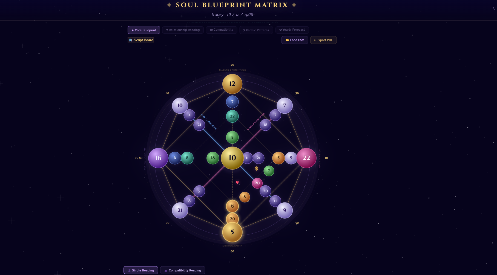
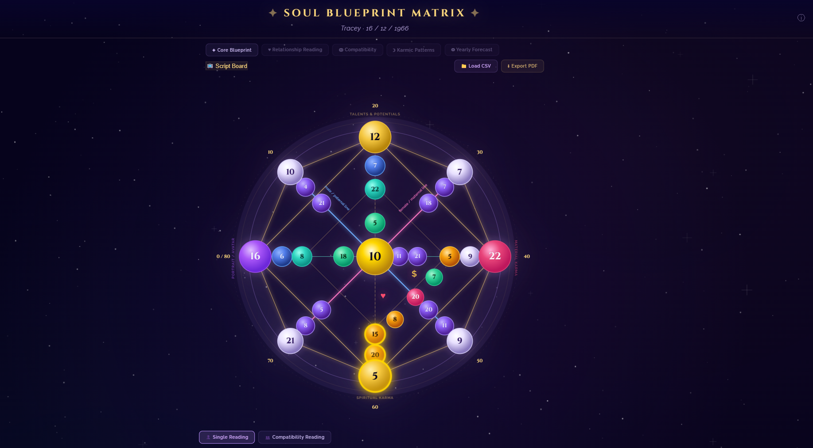
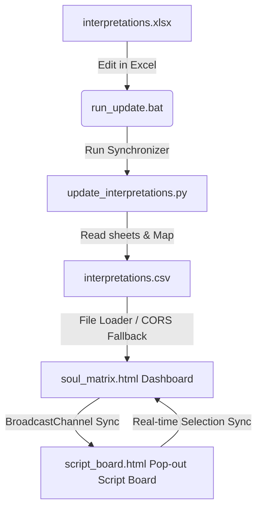
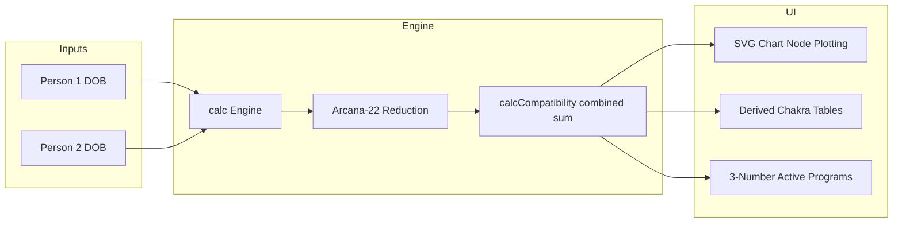

# ✦ SoulMatrix ✦


-orange?style=flat-square)

> A premium, dynamic live-reading dashboard and pop-out Script Board for Destiny Matrix (Soul Blueprint) analysis, featuring real-time multi-screen synchronization and couples compatibility engines. Engineered by **Ahmad Hasaan (B-Ted)**.

---

## 📺 Overview

**SoulMatrix** is a professional-grade tool designed for numerologists, spiritual consultants, and content creators (specifically optimized for OBS/TikTok Live streaming). It calculates a client's Destiny Matrix octagram using their birth date, plots it onto an interactive SVG chart, and dynamically renders detailed script interpretations from a customizable Excel/CSV database.

Additionally, a secondary **Script Board** window communicates offline in real-time, allowing readings to run on a double-monitor setup without lag or external server dependencies.

---

## 📸 Interface Modernization (Before vs After)

Here is a side-by-side comparison of the visual modernization of the matrix chart:

| Before Visual Refresh | After Visual Refresh |
| :---: | :---: |
|  |  |

---

## 🌟 Key Features

* **👤 Single & 👥 Couples Compatibility Modes**: Toggle between individual matrix readings and combined relationship charts. The compatibility engine sums both partners' coordinates and reduces them (Major Arcana modulo-22) to plot a shared energetic map (Love, Finances, friction points, joint purposes).
* **📅 Outer Ring Age Timeline**: Displays decadic life milestone labels (`0/80`, `10`, `20`, `30`, `40`, `50`, `60`, and `70`) concentrically outside the octagram's anchor points for instant chronological reference during live sessions.
* **📺 Pop-out Script Board**: A second screen layout for streamers that runs real-time, bidirectional sync (clicking nodes on either screen highlights and highlights the other screen instantly).
* **🔍 Dynamic Excel Sync Tool**: Edit and maintain your entire database of interpretations (including custom categories or 3-number combination programs) in a standard Excel sheet. Run `run_update.bat` to sync it to the application.
* **🔎 Text Sizing Zoom**: Instant zoom options (**Small**, **Medium**, **Large**, **Extra Large**) on the Script Board to adjust text readability on streams. Choice is persisted in browser local storage.

---

## 🏗 System Architecture

The following diagram illustrates the offline data pipeline and synchronization flow between the Excel sheets, sync tool, local CSV, main dashboard, and the streamer pop-out screen:



---

## 📈 Data Flow & Calculation Pipeline

The calculation engine maps raw dates of birth (DOBs) to the matrix structure and reduces them using Arcana-22 math:



---

## 🛠 Tech Stack

* **Frontend**: HTML5, Vanilla CSS3 (with custom variables and CSS keyframe glowing animations), and Modern JavaScript (ES6+).
* **Synchronization**: HTML5 `BroadcastChannel` API (for fast, offline cross-window communication).
* **Database Parsing**: HTML5 `FileReader` and local storage caching.
* **Sync Tool**: Python 3 and the `openpyxl` library.

---

## 📂 Repository Structure

The project directory is structured as follows:

```text
SoulMatrix/
├── data/
│   ├── interpretations.xlsx      ← Excel Master Database (edit this!)
│   └── interpretations.csv       ← Compiled CSV database
├── src/
│   ├── soul_matrix.html          ← Interactive chart dashboard
│   ├── script_board.html         ← Pop-out streamer Script Board
│   ├── server.py                 ← Python web server
│   └── server.ps1                ← PowerShell web server (fallback)
├── tools/
│   ├── update_interpretations.py ← Excel-to-CSV database sync tool
│   └── backups/                  ← Automatically generated CSV backups
├── run_locally.bat               ← Launcher to start the web server
├── run_update.bat                ← Sync Excel edits to CSV
├── README.md                     ← Project documentation
├── CHANGELOG.md                  ← Release version history
├── HOW-TO-UPDATE.md              ← Excel update instructions
└── .gitignore                    ← Git file exclusions
```

---

## 🚀 Quick Start

1. **Launch the Chart**:
   * Double-click `run_locally.bat` to start the local Python server.
   * Open `http://localhost:8000/src/soul_matrix.html` in Google Chrome.

2. **Open the Pop-out Board**:
   * Click the **📺 Script Board** button on the main navigation bar.
   * Drag the script board to your second screen or capture it inside OBS.

3. **Manage Interpretations in Excel**:
   * Open `data/interpretations.xlsx` and make edits or add new columns.
   * Double-click `run_update.bat` to sync changes. Reload the browser page to apply updates.

---

## 📈 Calculation Engine Details

### Arcana-22 Reduction Math
All calculations in the chart are mathematically reduced to a number between 1 and 22 based on the Major Arcana:
$$\text{reduced}(n) = \begin{cases} n, & \text{if } n \le 22 \\ \text{sum of digits of } n, & \text{if } n > 22 \end{cases}$$
If the intermediate sum is still greater than 22, it is recursively reduced.

### Couples Summation
Compatibility charts sum the individual partner matrix points for each position and apply the reduction:
$$\text{Node}_{\text{compatibility}} = \text{reduced}(\text{Node}_{\text{PartnerA}} + \text{Node}_{\text{PartnerB}})$$
Derived purposes (Earth/Sky, Personal, Social, Paternal, Maternal, and Spiritual) and the Chakra Map are computed dynamically from these combined nodes.

---

## 🤝 Contribution Guidelines

New contributions are welcomed to make the tool more versatile:
1. Fork the repository.
2. Create a new branch for the feature or layout refresh.
3. Keep code comments minimal and document technical logic inside the files or `docs/`.
4. Submit a Pull Request.
