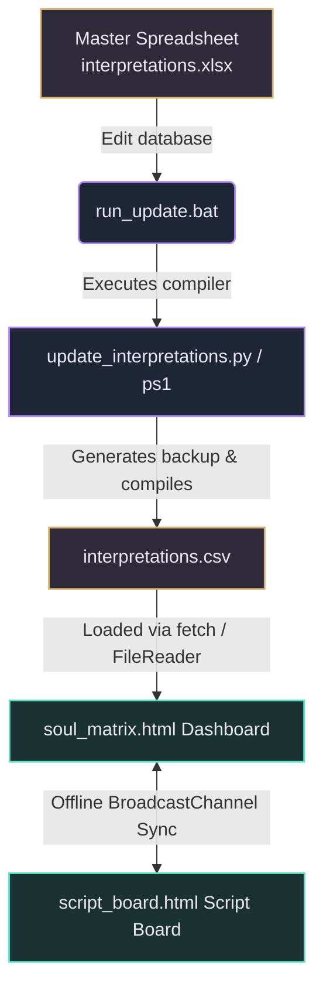
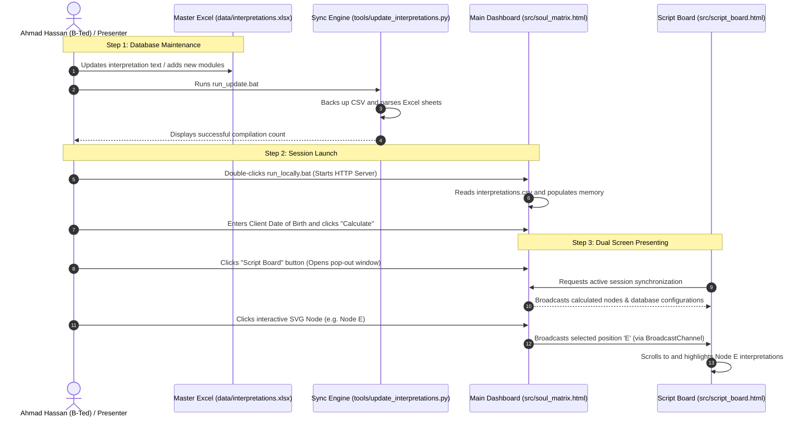
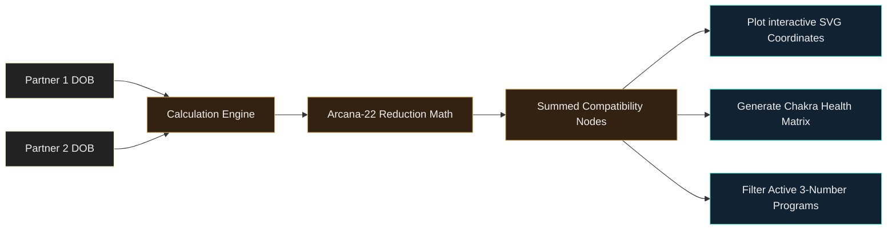
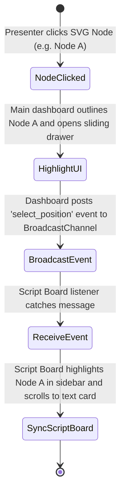
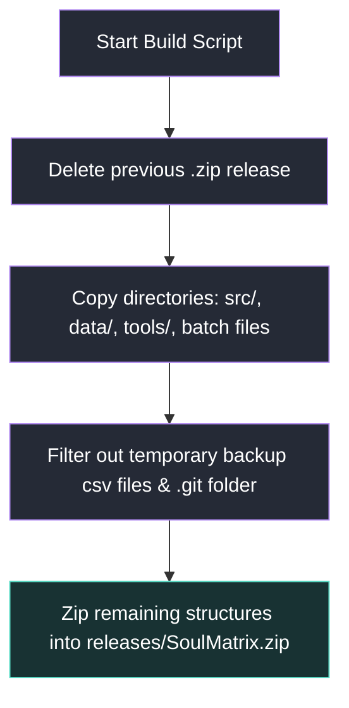

<p align="center">
  
</p>

<h1 align="center"> SoulMatrix </h1>

<p align="center">
  <a href="https://github.com/B-Ted/SoulMatrix"></a>
  
  
  
  
</p>

<p align="center">
  <strong>A premium, local-first interactive live-reading matrix dashboard and pop-out Script Board for Destiny Matrix (Soul Blueprint) analysis. Engineered with real-time multi-screen offline synchronization and dual-DOB compatibility engines.</strong>
</p>
<p align="center">
  <em>Designed and engineered by <a href="https://github.com/B-Ted">Ahmad Hassan (B-Ted)</a>. Built to bridge spiritual numerology with premium human-centric design and technology.</em>
</p>

---

##  Overview

**SoulMatrix** is a high-performance interactive tool designed for numerologists, spiritual consultants, and live-stream presenters (specifically optimized for OBS, TikTok Live, and dual-monitor configurations). 

It calculates a client's Destiny Matrix octagram using their birth date, plots it onto a modernized interactive SVG chart, and dynamically renders detailed script interpretations loaded directly from a customizable Excel master database. To support live streaming, a secondary **Script Board** window communicates offline in real-time, allowing presenters to display interpretation details on a private screen while displaying the interactive matrix chart to their audience.

---

##  Visual Modernization (Before vs After)

SoulMatrix features a refined UI refresh designed to captivate clients during live sessions. Hover effects, glowing neon states, and color-coded zone divisions provide instant clarity:

| Muted Gradients & Low Contrast (Original) | Vibrant Gradients & Glowing Outlines (Modernized) |
| :---: | :---: |
|  |  |

---

##  Key Features

* ** Single &  Couples Compatibility Mode**: Calculates combined matrix nodes by adding corresponding coordinates and reducing them (modulo-22 Major Arcana reduction). Renders specialized compatibility tabs (`General`, `Love Dynamics`, `Relationship Karma`, and `Shared Finance`) to show relationship dynamics.
* ** Outer Ring Age Timeline**: Displays decadic life milestone labels (`0/80` to `70`) concentrically, along with **56 intermediate age timeline nodes** mapped dynamically along the perimeter lines of the octagram SVG, each clickable and fully integrated into the database forecast readings.
* ** Pop-out Script Board**: A secondary control window featuring offline, real-time, bidirectional sync. Selecting a node or active program on one screen updates the active selection on the other instantly.
* ** Dynamic Excel Sync Engine**: Maintain your entire interpretation library—including custom categories or 3-number combinations—within Excel. Run the compiler tool to sync changes instantly.
* ** Font Zoom Controller**: Fine-tune script board text sizing (Small, Medium, Large, Extra Large) for optimal readability. User preferences are persisted locally in the browser.

---

##  Architecture Overview

The system operates local-first and zero-dependency, ensuring maximum reliability and privacy during live sessions. 



---

##  System Workflow

This diagram outlines the complete workflow loop, from database maintenance to rendering and live presenting:



---

##  Repository Structure

The layout separates core runtime assets, Excel data configurations, and build/sync scripts:

```text
SoulMatrix/
├── data/
│   ├── interpretations.xlsx      ← Excel Master Database (edit this!)
│   └── interpretations.csv       ← Compiled CSV database mapping (loaded by web page)
├── docs/
│   └── images/                   ← UI comparison screenshots and visual assets
├── src/
│   ├── soul_matrix.html          ← Interactive matrix chart dashboard (Presenter display)
│   ├── script_board.html         ← Pop-out private reader/presenter Script Board
│   ├── server.py                 ← Python local HTTP server
│   └── server.ps1                ← PowerShell local HTTP server (automated fallback)
├── tools/
│   ├── update_interpretations.py ← Excel-to-CSV compilation sync engine (Python)
│   ├── update_interpretations.ps1 ← Excel-to-CSV compilation sync engine (PowerShell fallback)
│   └── backups/                  ← Automatically generated CSV backup files
├── run_locally.bat               ← Launcher script to host application locally
├── run_update.bat                ← Shortcut batch script to compile Excel edits
├── README.md                     ← Main documentation file
├── CHANGELOG.md                  ← Release version and feature update history
├── HOW-TO-UPDATE.md              ← Detailed Excel mapping guide
└── .gitignore                    ← Git ignore rules
```

---

##  Data Flow & Calculation Pipeline

The core engine maps birth dates to the matrix structure and reduces them using base-22 Major Arcana reduction math:



<details>
<summary> Click to view Arcana-22 Math & Summation Formulas</summary>

### Arcana-22 Reduction Math
All numerical nodes in the Destiny Matrix are mathematically reduced to a value between `1` and `22` (corresponding to the Major Arcana):
$$\text{reduced}(n) = \begin{cases} n, & \text{if } n \le 22 \\ \text{sum of digits of } n, & \text{if } n > 22 \end{cases}$$
If the sum of digits is still greater than 22, the reduction formula is applied recursively until the value falls within the $[1, 22]$ range.

### Compatibility Coordinate Summation
For Couples Compatibility Mode, nodes for each partner are summed and reduced:
$$\text{Node}_{\text{compatibility}} = \text{reduced}(\text{Node}_{\text{PartnerA}} + \text{Node}_{\text{PartnerB}})$$
Derived purposes (Personal, Social, and Spiritual) and the combined Chakra energy table are calculated dynamically using these compatibility coordinates.
</details>

---

##  Request Lifecycle & Sync Mechanics

When a presenter interacts with a node, the application triggers a real-time event pipeline:



---

##  Tech Stack

* **Frontend**: HTML5, Vanilla CSS3 (custom variables, keyframe animations, responsive grid), Vanilla JavaScript (ES6+).
* **Synchronization**: HTML5 `BroadcastChannel` API (for zero-latency offline cross-window messaging).
* **Database Parsing**: HTML5 `FileReader` and local storage caching for offline file imports.
* **Sync Engine**: Python 3 with the `openpyxl` library (or native Windows PowerShell + COM Automation fallback for zero-dependency local environments).

---

##  Quick Start

1. **Launch the Server**:
   * Double-click **[run_locally.bat](./run_locally.bat)**.
   * The script automatically starts a local HTTP server and opens **[soul_matrix.html](./src/soul_matrix.html)** in Google Chrome.

2. **Open the Pop-out Script Board**:
   * Click ** Script Board** on the main navigation bar.
   * Drag **[script_board.html](./src/script_board.html)** to your second monitor or capture it as an overlay inside OBS.

3. **Modify Interpretations**:
   * Edit **[interpretations.xlsx](./data/interpretations.xlsx)** using Excel.
   * Double-click **[run_update.bat](./run_update.bat)** to sync. Reload Chrome to view updates.

---

##  Internal Module Structure

The sync engine handles data separation based on worksheet origins:

* **Master_Database Sheet**: Processes single-DOB reading nodes. Sections are mapped to standard tabs (`Core`, `Love`, `Karma`, `Money`, `Purpose`, `Forecast`).
* **Compatibility Sheet**: Processes dual-DOB relationship nodes. Sections are automatically prefixed with `compat_` to construct distinct tabs (`General`, `Love Dynamics`, `Relationship Karma`, `Shared Finance`).
* **3-Number Combination Programs**: Matches numeric groupings (e.g. `15-20-5` for position `M-N-D`). Renders active programs prominently inside the calculations section and sidebar.

---

##  Build & Deployment Pipeline

To package clean production bundles for end-users, follow the packaging workflow:



---

##  Contribution Guidelines

New enhancements and optimizations are welcomed to make the tool more versatile for presenters.
1. Fork the repository.
2. Create a clean feature branch (`feature/your-addition`).
3. Keep code comments minimal and document technical logic inside documentation files.
4. Verify changes by executing **[run_update.bat](./run_update.bat)** to confirm no compiler regressions are introduced.
5. Submit a Pull Request.

---

<p align="center">
  <em>SoulMatrix is dedicated to the study of self-discovery and destiny calculation. Developed with precision by Ahmad Hassan (B-Ted).</em>
</p>
